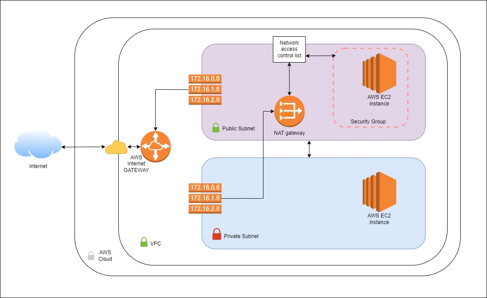

# Terraform for AWS - Creating VPC, Subnets, Route Tables, EC2 Instances

## Overview

This project demonstrates how to use **Terraform** to create AWS infrastructure. The architecture example includes public and private subnets, EC2 instances, and necessary networking components, but can modified as well. Below is a schema of the infrastructure:

---

## Features

This Terraform configuration creates the following AWS resources:
- **VPC**: A Virtual Private Cloud for isolating your AWS resources.
- **Subnets**:
  - **Public Subnet** for resources that require internet access.
  - **Private Subnet** for resources without direct exposure to the internet.
- **Route Tables**: Configured for routing traffic within the VPC.
- **Security Groups**: For controlling access to EC2 instances.
- **Internet Gateway**: To enable internet connectivity for the VPC.
- **NAT Gateway**: To allow private instances to securely access the internet.
- **Network Access Control Lists (NACLs)**: Adding an extra layer of security.
- **EC2 Instances**: Deployed in both public and private subnets.

---

## Prerequisites

### AWS Account Setup
1. **Root User**:
   - Enable **MFA (Multi-Factor Authentication)**.
   - Set up **Cost and Billing Alerts**!!!.
2. **Developer User**:
   - Create a user with **limited or admin permissions**.
   - Enable **MFA** for the user.
3. Install **AWS CLI** and configure it for the developer user:
   - [AWS CLI Installation Guide](https://aws.amazon.com/cli/)

### Project files
aws_vps_ec2
├── main.tf
├── output.tf
├── variables.tf
└── Taskfile.yaml

1. **main.tf**: This is the core configuration file where you define the infrastructure resources you want to create or manage. It includes resources like EC2 instances, security groups, networks, etc.
2. **output.tf**: This file defines the values you want to export from your Terraform configuration. For example, you might want to output the public IP addresses of your EC2 instances.
3. **variables.tf**: This file defines variables that you can use in your main.tf file. This helps you make your configuration more flexible and reusable. For example, you could define a variable for the instance type or AMI ID.
4. **Taskfile.yaml**: This file defines tasks that you can run to automate common operations, such as creating or destroying infrastructure. This can help you streamline your workflow and reduce the risk of errors.

### Install Terraform
You can install Terraform manually or by running the Task command provided in the repository.